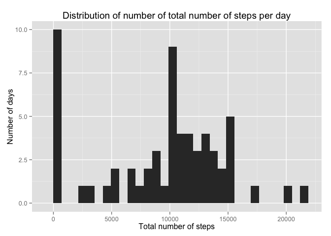
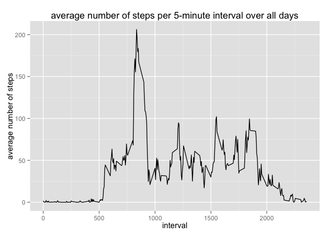
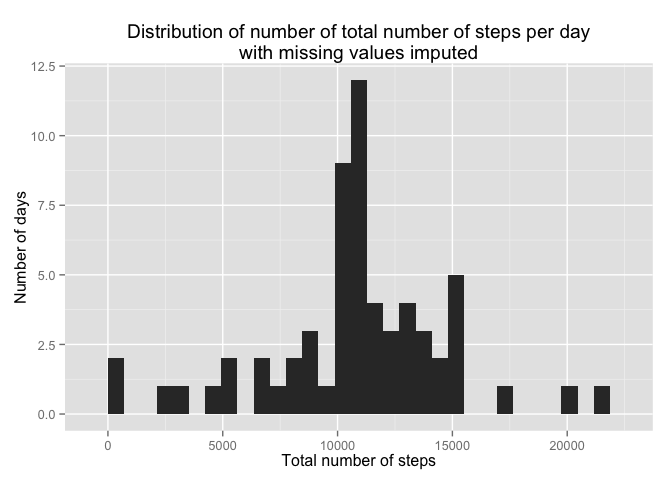
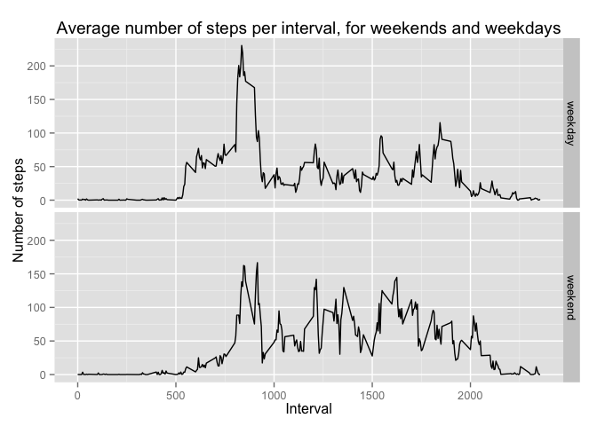

# Reproducible Research: Peer Assessment 1


## Loading and preprocessing the data

Unzip and read the data from the file _activity.zip_.


```r
activity.data <- read.table(unz("activity.zip","activity.csv"), header = TRUE, sep = ",", colClasses = c("numeric","Date","integer"))
```

## What is mean total number of steps taken per day?

The following histogram shows distribution of the total number of steps taken each day. Missing values are ignored (complying with the instructions for this assignment).


```r
library(dplyr)
```

```
## 
## Attaching package: 'dplyr'
## 
## The following objects are masked from 'package:stats':
## 
##     filter, lag
## 
## The following objects are masked from 'package:base':
## 
##     intersect, setdiff, setequal, union
```

```r
library(ggplot2)
# Aggregate the number of steps, summing them per day, ignoring NA values
group.by.day <- group_by(activity.data, date)
activity.per.day <- summarize(group.by.day, total.steps = sum(steps, na.rm = TRUE))
# Construct histogram
g <- ggplot(activity.per.day, aes(total.steps))
g + geom_histogram() +
  labs(title = "Distribution of number of total number of steps per day",
       x = "Total number of steps",
       y = "Number of days")
```

 


```r
total.steps.mean <- round(mean(activity.per.day$total.steps), digits = 2)
total.steps.median <- median(activity.per.day$total.steps)
```
The mean total number of steps is **9354.23**

The median total number of steps is **10395.00**

## What is the average daily activity pattern?


```r
library(dplyr)
library(ggplot2)
# aggregate the activity data per time interval, taking average number of steps per interval over all days
group.by.interval <- group_by(activity.data, interval)
activity.per.interval <- summarize(group.by.interval, average.steps = mean(steps, na.rm = TRUE))
# plot the values for each interval as a line graph
g <- ggplot(activity.per.interval, aes(interval, average.steps))
g + geom_line() +
  labs(title = "average number of steps per 5-minute interval over all days",
       x = "interval",
       y = "average number of steps")
```

 


```r
interval.with.max.steps <- activity.per.interval[which.max(activity.per.interval$average.steps),]
```

The 5-minute interval with the highest average number of steps is **835**

It has **206.1698113** steps on average

## Imputing missing values


```r
number.of.missing.values <- sum(!complete.cases(activity.data))
```

The number of missing values (i.e. intervals for which the number of steps is unknown) equals **2304**

For filling in the missing values, we take the following strategy: for each interval with a missing value we take the mean value for that interval over all days.


```r
# first, copy the original data
activity.data.imputed <- activity.data
# replace NA values with the mean value of the interval
indices.missing.values <- which(is.na(activity.data.imputed$steps))
activity.data.imputed[indices.missing.values,"steps"] <- activity.per.interval$average.steps[match(activity.data.imputed[indices.missing.values,"interval"],activity.per.interval$interval)]
```

Like before, we aggregate and sum the steps per day


```r
library(dplyr)
library(ggplot2)
# Aggregate the number of steps, summing them per day, ignoring NA values
group.by.day <- group_by(activity.data.imputed, date)
activity.per.day.imputed <- summarize(group.by.day, total.steps = sum(steps, na.rm = TRUE))
# Construct histogram
g <- ggplot(activity.per.day.imputed, aes(total.steps))
g + geom_histogram() +
  labs(title = "Distribution of number of total number of steps per day\nwith missing values imputed",
       x = "Total number of steps",
       y = "Number of days")
```

 


```r
total.steps.imputed.mean <- mean(activity.per.day.imputed$total.steps)
total.steps.imputed.median <- median(activity.per.day.imputed$total.steps)
```

The mean total number of steps (with missing values imputed) is **10766.19**

The median total number of steps (with missing values imputed) is **10766.19**

These values are higher than those of the first part of the assignment (without imputing missing values). The effect of imputing missing values is that the mean and median are equal.


## Are there differences in activity patterns between weekdays and weekends?


```r
# add factor variable day.type that indicates whether date is in a weekend or is a weekday
activity.data.imputed$day.type <- ifelse(weekdays(activity.data.imputed$date) %in% c("Saturday","Sunday"),"weekend","weekday")
# calculate average number of steps per time interval over all days
group.by <- group_by(activity.data.imputed, interval, day.type)
activity.per.interval.daytype <- summarize(group.by, average.steps = mean(steps, na.rm = TRUE))
# plot average number of steps per interval, split out by weekdays and weekends
g <- ggplot(activity.per.interval.daytype, aes(interval, average.steps))
g + geom_line() + facet_grid(day.type ~ .) +
  labs(title="Average number of steps per interval, for weekends and weekdays",
       x = "Interval",
       y = "Number of steps")
```

 
